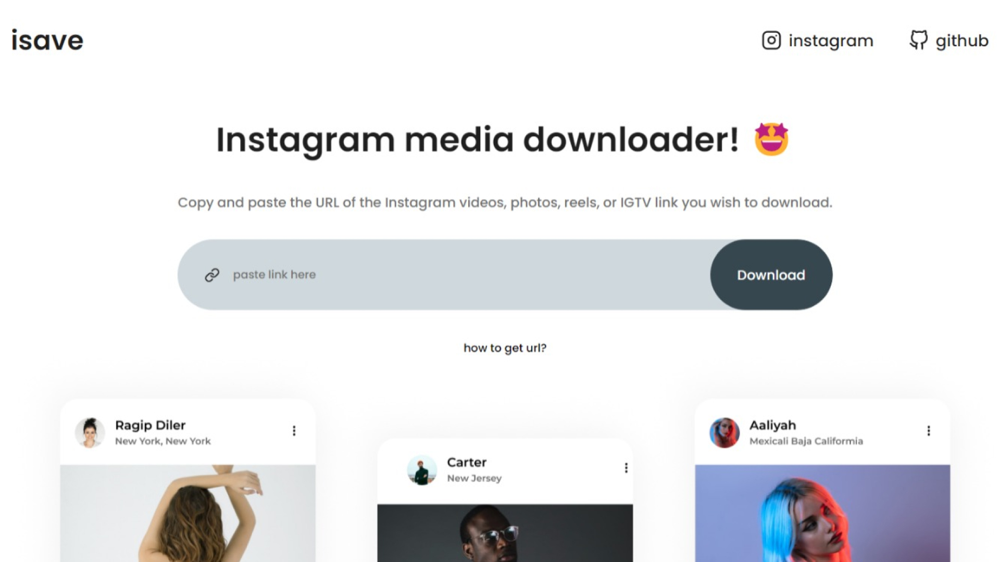
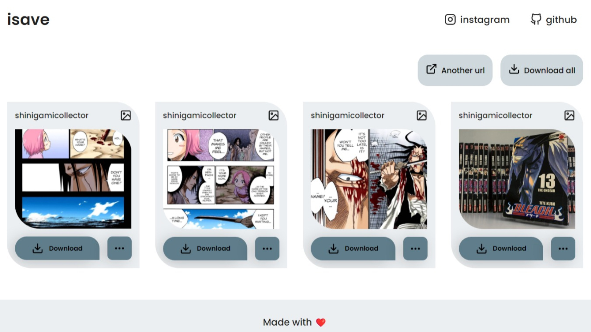

# ISAVE

Isave allows you to save any media from Instagram, including reels, posts, videos, IGTV, and images.

# SCREENSHOTS





# DEMO

[Web-app](https://isave.cc/)

## Installation

```bash
yarn add or npm install
```

## Usage

```react
yarn start or npm start
```

## Contributing

Pull requests are welcome. For major changes, please open an issue first to discuss what you would like to change.

Please make sure to update tests as appropriate.
