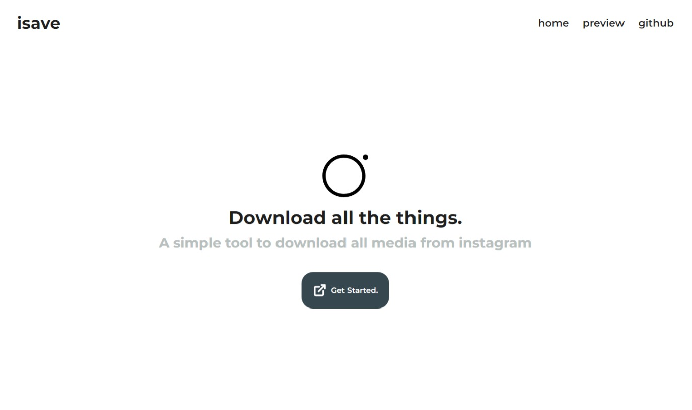
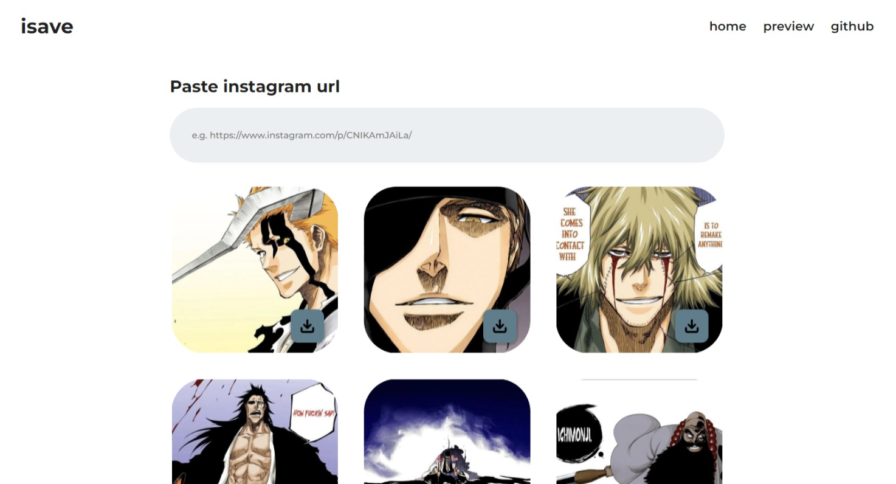
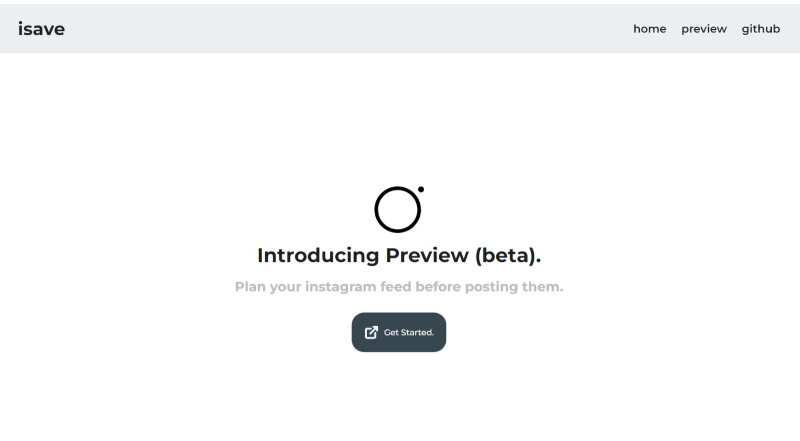
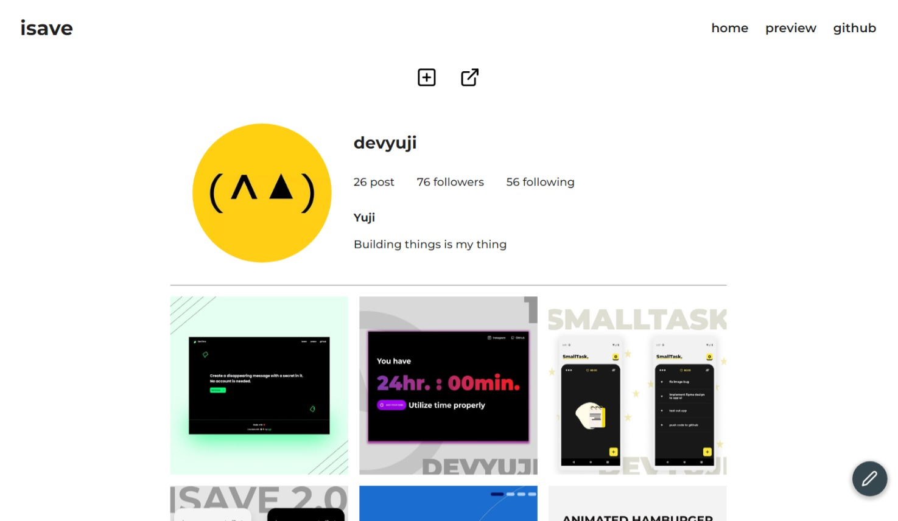

# ISAVE

Instagram tool to download images, videos, reels in one place

# SCREENSHOTS






# DEMO

[Web App](https://isave.cc/)

[Android app](https://github.com/devyuji/isave_flutter)

## Installation

```bash
yarn add or npm install
```

## Usage

```react
yarn start or npm start
```

## Contributing

Pull requests are welcome. For major changes, please open an issue first to discuss what you would like to change.

Please make sure to update tests as appropriate.
