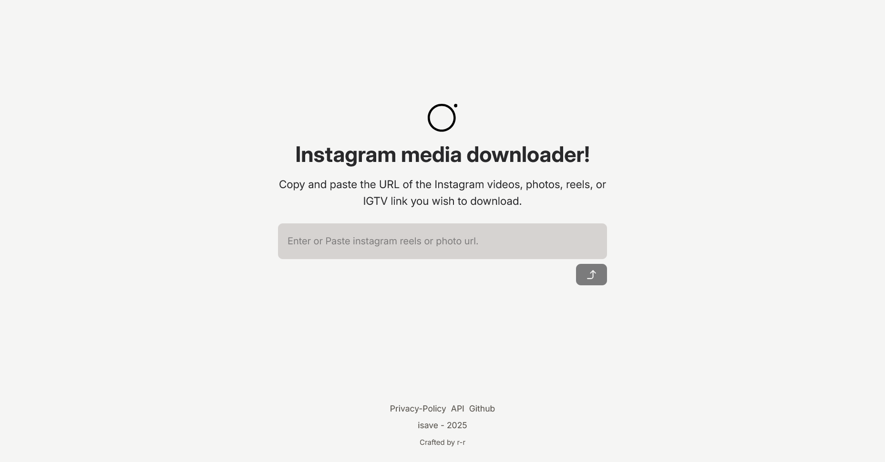
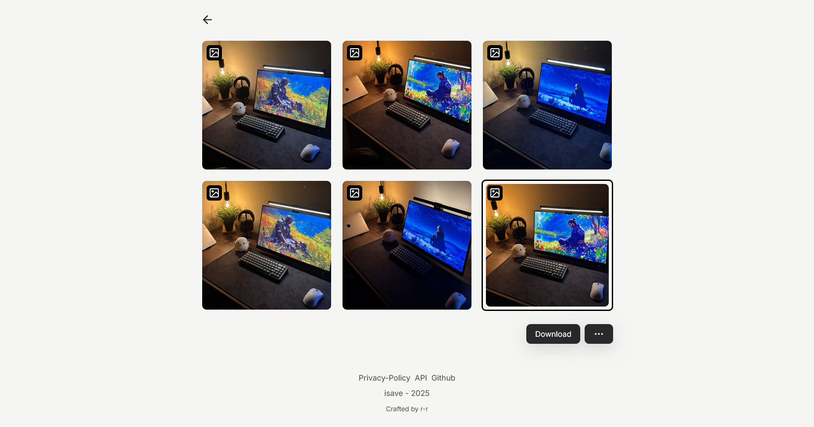

# isave

isave allows you to save any media from Instagram, including reels, posts, videos, IGTV, and images.

# SCREENSHOTS





# DEMO

[Web-app](https://www.isave.cc/)

## Installation

```bash
git clone "https://github.com/devyuji/isave.git"
cd isave/
npm install
```

## Usage

```react
npm dev
```

## Contributing

Pull requests are welcome. For major changes, please open an issue first to discuss what you would like to change.

Please make sure to update tests as appropriate.
